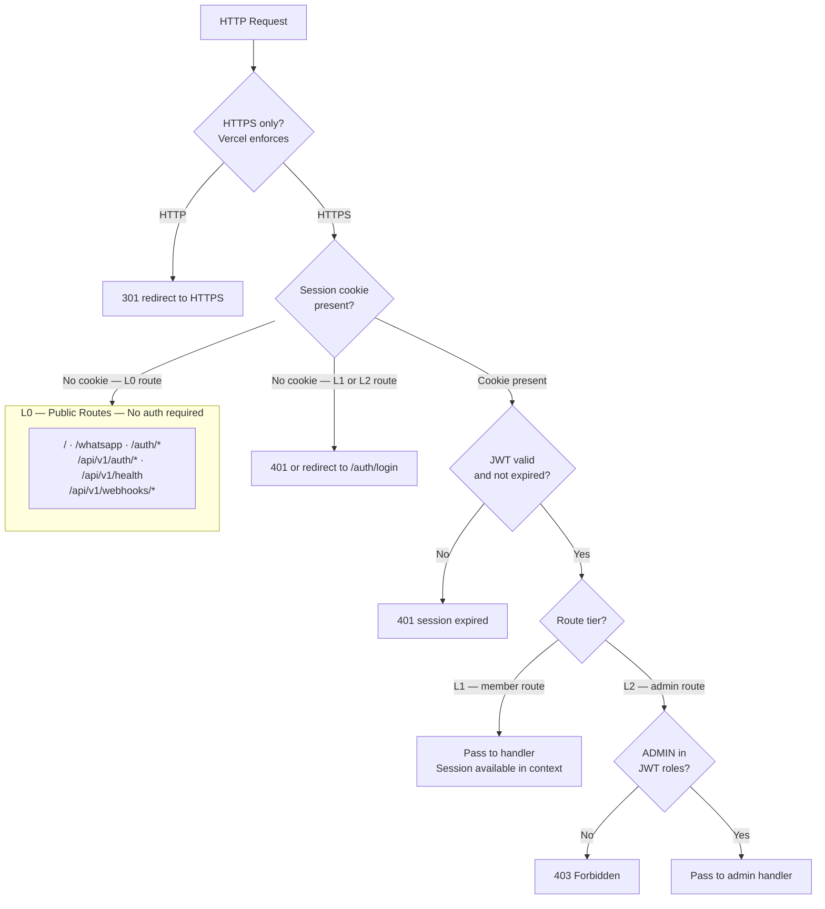
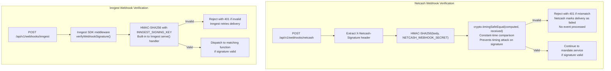
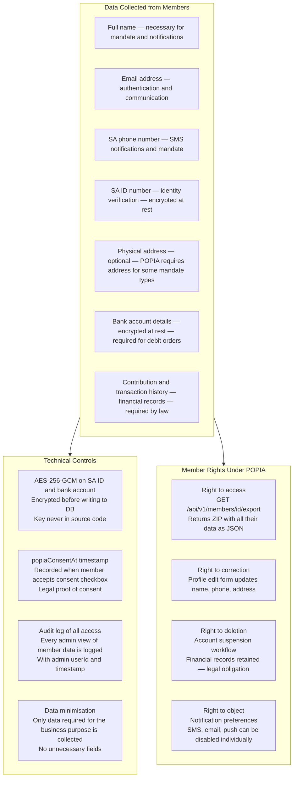
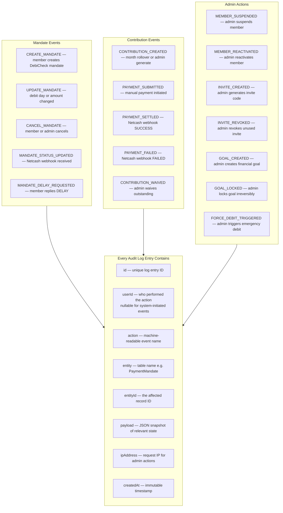

# Security Architecture

| | |
|---|---|
| **Purpose** | Documents every security layer in the system — authentication tiers, encryption, rate limiting, webhook verification, POPIA compliance, and the audit trail |
| **Audience** | Engineers, security reviewers, compliance |
| **Related Docs** | [../flows/01-auth-flow.md](../flows/01-auth-flow.md) · [../database/03-schema-design.md](../database/03-schema-design.md) · [../flows/05-invite-registration-flow.md](../flows/05-invite-registration-flow.md) |

---

## Diagram 1 — Security Layers Overview

```mermaid
flowchart TD
    subgraph LAYER1["Layer 1 — Transport Security"]
        L1A["HTTPS enforced everywhere\nVercel automatic TLS\nHTTP redirects to HTTPS\nHSTS header set"]
        L1B["HTTP-only cookies\nSession token not accessible via JavaScript\nXSS cannot steal the session"]
        L1C["SameSite=Lax cookies\nCSRF protection built-in\nNextAuth CSRF token on state-changing requests"]
    end

    subgraph LAYER2["Layer 2 — Authentication and Authorisation"]
        L2A["NextAuth.js Credentials provider\nJWT signed with NEXTAUTH_SECRET\n30-day session TTL"]
        L2B["Route tier enforcement in middleware\nL0 public, L1 member, L2 admin\nEvery request checked before handler"]
        L2C["Role claims in JWT\nADMIN and MEMBER roles\nNever trust client-supplied userId"]
    end

    subgraph LAYER3["Layer 3 — Input Validation"]
        L3A["Zod schemas on every API route\nClient and server share the same schema\nRejects malformed input before service layer"]
        L3B["SA-specific validators\nLuhn check on SA ID number\nRegex on SA phone format\n+27 normalisation"]
        L3C["Domain constraint validation\ndebitDay 1 to 28\namount min R100\nperiod month 1 to 12"]
    end

    subgraph LAYER4["Layer 4 — Data Protection"]
        L4A["AES-256-GCM encryption\nSA ID number and bank account number\nRandom IV per value\nNever stored in plaintext"]
        L4B["bcrypt password hashing\nCost factor 12\nResistant to GPU brute force\nRainbow tables impossible"]
        L4C["Hashed tokens\nPassword reset and email verification\nSHA-256 hash stored not raw token\nCompromised DB cannot redeem tokens"]
    end

    subgraph LAYER5["Layer 5 — Rate Limiting and Abuse Prevention"]
        L5A["Upstash Redis sliding window\nAuth routes: 5 per 15 min per IP\nMandate mutations: 10 per hour per user\nInvite validation: 5 per 15 min per IP"]
        L5B["Idempotency keys in DB\nUNIQUE constraint prevents double-charge\nSafe under concurrent requests and retries"]
        L5C["Invite code entropy\n50-bit Crockford Base32\nBrute force infeasible at 5 attempts per 15 min"]
    end

    subgraph LAYER6["Layer 6 — Webhook Security"]
        L6A["HMAC-SHA256 on Netcash webhooks\ntimingSafeEqual comparison\nPrevents signature timing attacks"]
        L6B["Inngest signing key verification\nBuilt-in to Inngest SDK\nRejects unsigned or tampered payloads"]
        L6C["BulkSMS IP allowlist\nOnly BulkSMS IP ranges accepted\nfor delivery receipt webhooks"]
    end

    subgraph LAYER7["Layer 7 — Audit and Compliance"]
        L7A["Append-only audit_logs table\nEvery admin action logged\nIP address, userId, action, entity, payload"]
        L7B["POPIA data export endpoint\nMember can download their own data\nZIP with JSON data extract"]
        L7C["Data minimisation\nOnly SA ID and bank account collected\nNot more than needed"]
    end

    LAYER1 --> LAYER2 --> LAYER3 --> LAYER4
    LAYER4 --> LAYER5 --> LAYER6 --> LAYER7
```

---

## Diagram 2 — Route Tier Security Model

---

## Diagram 3 — Encryption Architecture

```mermaid
flowchart LR
    subgraph ENCRYPT_WRITE["Write Path — Encrypting sensitive data"]
        W1["Application receives\nplaintext SA ID or bank account number"]
        W2["lib/encryption.ts encrypt()"]
        W3["Generate 12-byte random IV\ncrypto.randomBytes(12)"]
        W4["AES-256-GCM encrypt\nKey from ENCRYPTION_KEY env var\n32 bytes — 256 bits"]
        W5["Produce: ciphertext + authTag\nFormat stored: base64(iv):base64(authTag):base64(ciphertext)"]
        W6["Store opaque string in DB\nusers.idNumber or bank_accounts.accountNumber"]
    end

    subgraph DECRYPT_READ["Read Path — Decrypting when needed"]
        R1["Fetch encrypted string from DB"]
        R2["Split on colon separator\nExtract IV, authTag, ciphertext"]
        R3["AES-256-GCM decrypt\nSame key from ENCRYPTION_KEY\nVerify authTag — detects tampering"]
        R4["Return plaintext to caller\nHeld in memory only\nNever logged or cached"]
        R5["Used for: Netcash API calls\nAdmin viewing member bank details\nPOPIA data export"]
    end

    W1 --> W2 --> W3 --> W4 --> W5 --> W6
    W6 --> R1 --> R2 --> R3 --> R4 --> R5
```

---

## Diagram 4 — Webhook Verification Chain

---

## Diagram 5 — POPIA Compliance Map

---

## Diagram 6 — Rate Limiting Strategy

```mermaid
flowchart LR
    subgraph LIMITS["Rate Limits by Endpoint Type"]
        RL1["Authentication — per IP\n5 requests per 15 minutes\nPrevents credential stuffing\nApplied at middleware level"]

        RL2["Invite validation — per IP\n5 requests per 15 minutes\nPrevents invite code brute force\nApplied at route handler level"]

        RL3["Mandate create/update/cancel — per user\n10 requests per 1 hour\nPrevents mandate spam\nApplied at route handler level"]

        RL4["Password reset request — per IP\n3 requests per 1 hour\nPrevents email flooding\nApplied at route handler level"]

        RL5["General API routes — per user\nNo hard limit currently\nVercel WAF handles DDoS at edge"]
    end

    subgraph IMPLEMENTATION["Implementation"]
        IMP1["Upstash Ratelimit with sliding window algorithm\n@upstash/ratelimit package"]
        IMP2["Rate limit key: ip or userId\nDepending on whether route requires auth"]
        IMP3["Limit check returns allow or deny with retryAfter\n429 response with Retry-After header"]
        IMP4["Redis TTL auto-expires counters\nNo manual cleanup required"]
    end

    LIMITS --> IMPLEMENTATION
```

---

## Diagram 7 — Audit Log Coverage

> Every admin action that writes an audit log entry.

---

## Security Decision Reference

| Decision | Choice | Reason |
|---|---|---|
| Session mechanism | HTTP-only JWT cookies | XSS cannot access `document.cookie` — token never in localStorage |
| Password hashing | bcrypt cost 12 | GPU-resistant — 12 rounds = ~250ms hash time, impractical to brute force |
| Token storage | SHA-256 hash only | Compromised DB cannot redeem tokens — plaintext never persisted |
| ID and bank account | AES-256-GCM | Authenticated encryption — detects tampering, not just confidentiality |
| IV strategy | Random 12-byte IV per value | Same plaintext never produces same ciphertext — prevents frequency analysis |
| Webhook verification | HMAC-SHA256 timingSafeEqual | Prevents both forgery and timing attacks on signature comparison |
| Rate limiting | Sliding window per IP or user | Prevents credential stuffing, code brute force, and mandate spam |
| Idempotency key | UNIQUE DB column | DB-level guarantee — Redis failure cannot enable double-charge |
| User enumeration | Prevented on forgot-password | Always returns 200 — attacker cannot discover registered emails |
| Admin route protection | JWT role claim check in middleware | Role cannot be spoofed — claims are in server-signed JWT |
