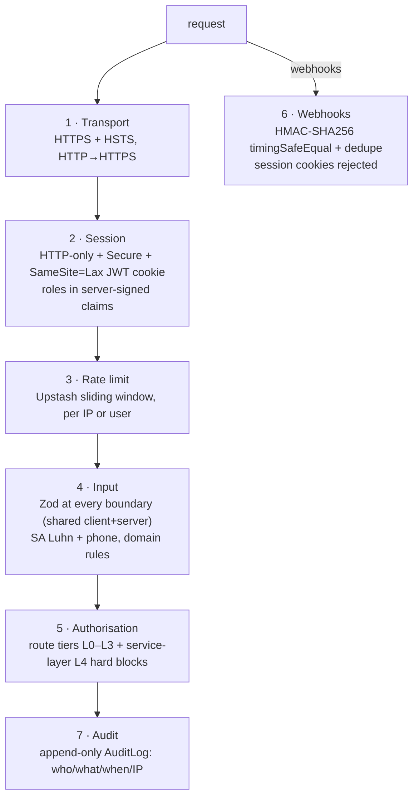
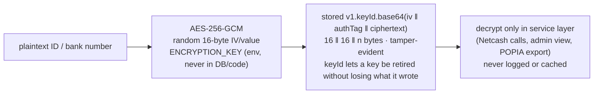
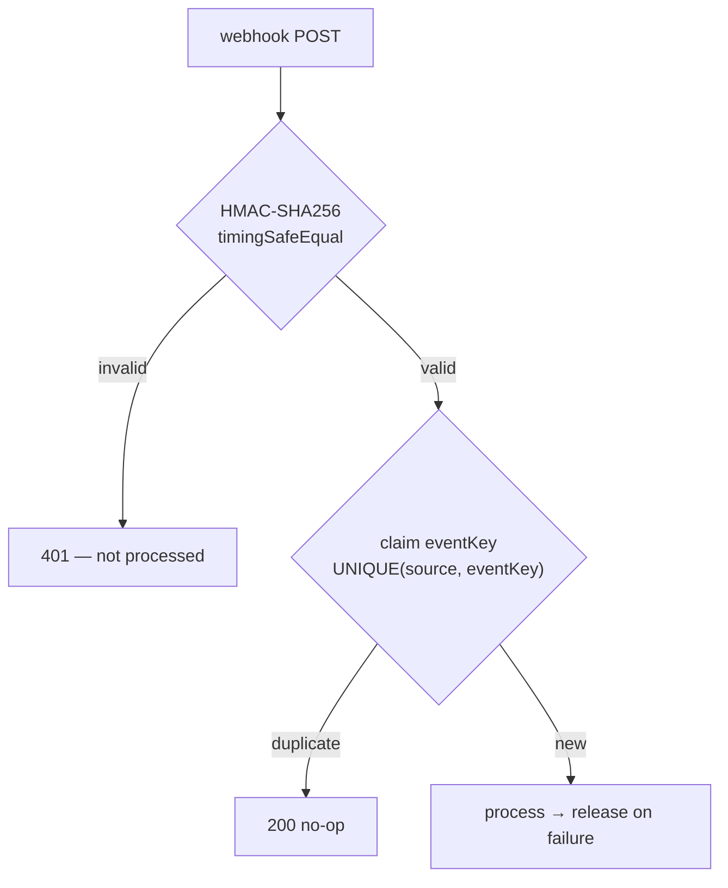

# Security Architecture

Every defence layer: transport, auth, validation, encryption, rate limiting, webhook verification, audit, and POPIA. Related: [../flows/01-auth-flow.md](../flows/01-auth-flow.md) · [../database/03-schema-design.md](../database/03-schema-design.md).

---

## Defence in depth

---

## Authentication & authorisation

Login → NextAuth Credentials → server-signed JWT in an **HTTP-only, Secure, SameSite=Lax** cookie. Middleware decodes it on every request and enforces the route tier; the role lives in the signed claims, so it can't be spoofed. Queries always use the session `x-user-id`, never a client-supplied id.

| Tier | Access | Rule |
|---|---|---|
| L0 | Public | No auth |
| L1 | Member | Own data only |
| L2 | Admin | All data, ledger, audit — ADMIN claim required |
| L3 | System | Webhooks — HMAC only |

**L4 hard blocks** (service layer, un-bypassable by middleware misconfig): no member reads another's bank/ID number; no member writes `Transaction`/`Contribution`/`LedgerEntry`; admins reverse rather than delete transactions; webhook endpoints reject session cookies.

## Data protection

| Data | Protection |
|---|---|
| Passwords | bcrypt cost 12 (~250ms, GPU-resistant) |
| ID / bank numbers | AES-256-GCM, random IV per value |
| Reset / verify / invite tokens | SHA-256 hash only; plaintext never stored; `usedAt` makes one-time |
| Email / phone | Plain — indexed for lookup (encrypting → `O(n)` login) |

## Rate limits

Sliding-window (Upstash), keyed per IP (pre-auth) or per user. Auth 5/15min · forgot-password 5/15min · verify-email 10/15min · invite-validate 5/15min · mandate create 10/h · mandate delay 5/h · admin invite 20/h · admin broadcast 5/h · admin bulk-generate 3/h. A leaked invite code is useless without the matching identity at these rates.

## Webhook security (exactly-once)

Netcash uses HMAC + IP allowlist; Inngest uses its signing key (in the SDK); BulkSMS uses an IP allowlist. Redelivery is safe — the dedupe table guarantees each event is processed once.

## Integrity & audit

Money is `Decimal(10,2)`; the pool is an **append-only ledger** (idempotent postings, nightly reconciliation), so the balance is always derivable and verifiable. `AuditLog` is append-only (`userId, action, entity, entityId, payload, ipAddress, createdAt`) — every state-changing operation writes one synchronously, including every admin access to member data. A daily **anomaly watch** alerts admins on abnormal collection rates, failed-debit spikes, or overdue thresholds.

## POPIA

Consent is timestamped at registration (`popiaConsentAt`). Members exercise rights via the app: **access** (`GET /members/:id/export` → ZIP of JSON), **correction** (profile edit), **objection** (per-channel notification opt-out), **deletion** (soft-delete; financial records retained 5 years by law). Only data needed for the business purpose is collected; nothing is shared beyond the payment processor (Netcash).

---

## Decision reference

| Decision | Choice | Why |
|---|---|---|
| Session | HTTP-only JWT cookie | XSS can't read it; never in `localStorage` |
| Cookie scope | `SameSite=Lax`, Secure | Survives top-level nav (email links) while blocking CSRF on cross-site POSTs |
| Passwords | bcrypt 12 | GPU-resistant |
| Tokens | SHA-256 hash | Breached DB holds no redeemable tokens |
| PII | AES-256-GCM | Authenticated — detects tampering |
| Webhooks | HMAC + dedupe | Stops forgery, timing attacks, and double-processing |
| Idempotency | UNIQUE DB column | DB-level — survives Redis outage |
| Forgot-password | Always 200 | No user enumeration |
