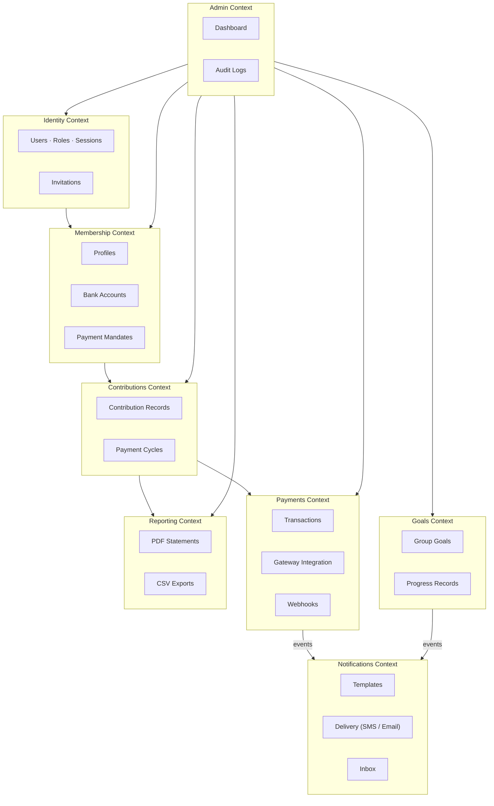
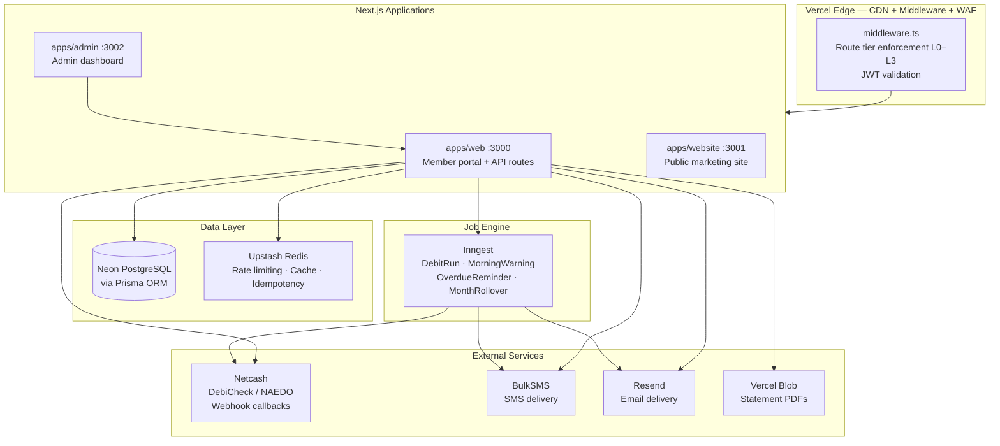
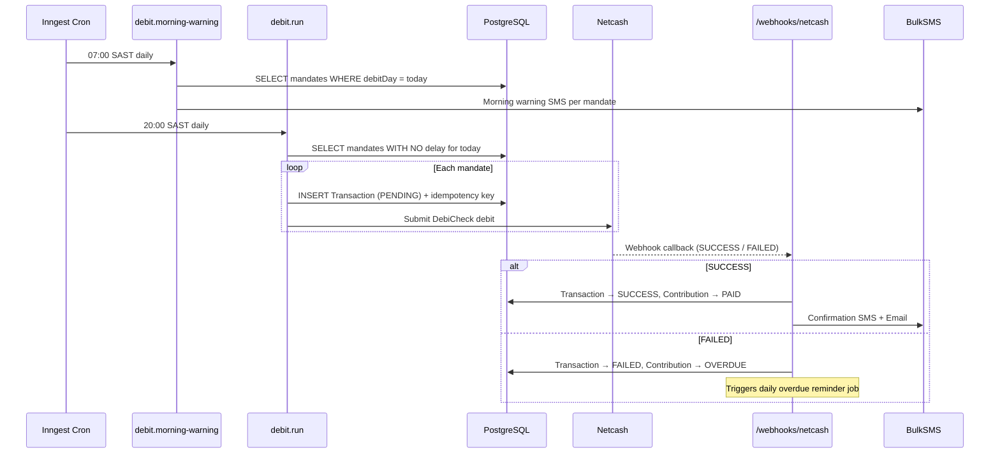
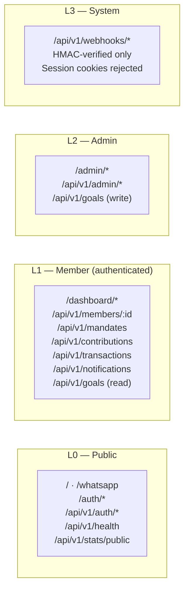

# Xkimm Xa Mali — System Overview

> "Blessed is the hand that giveth… It is more blessed to give than to receive." — Acts 20:35

| | |
|---|---|
| **Related Docs** | [requirements.md](./requirements.md) · [build-order.md](./build-order.md) · [api-contract.yaml](./api-contract.yaml) · [security/01-security-architecture.md](./security/01-security-architecture.md) |

---

## System Classification

| Attribute | Decision |
|---|---|
| **System Name** | Xkimm Xa Mali (XXM) |
| **Problem Domain** | Family savings group — contribution management, automated payments, financial tracking |
| **User Classes** | Admin (founder, dual role), Members/Contributors |
| **Scale Target** | 4–50 members, <1,000 req/day (v1) |
| **Data Sensitivity** | Financial + PII — highest classification |
| **Platform Target** | Web (PWA-capable, mobile-first) |
| **Existing Systems** | WhatsApp group (communication), SA banking (debit orders) |

| Layer | Technology | Why |
|---|---|---|
| Framework | Next.js App Router | Public-facing + member portal, SEO homepage, PWA |
| Database | PostgreSQL via Prisma | ACID compliance — non-negotiable for financial data |
| Auth | NextAuth.js + JWT HTTP-only cookies | Session security without localStorage exposure |
| Payment | Netcash (DebiCheck/NAEDO) | SA-native recurring debit — PayFast is e-commerce only |
| SMS | BulkSMS | Leading SA SMS provider with delivery receipts |
| Email | Resend | Transactional, developer-first |
| Jobs | Inngest | Durable retryable jobs — Vercel Cron has no retry guarantee |
| Cache/Rate | Upstash Redis | Serverless-compatible, sliding window rate limiting |
| Deployment | Vercel + Neon + Upstash | Serverless-native, zero ops overhead at this scale |
| Storage | Vercel Blob | Statement PDFs with signed URL access |
| Monitoring | Sentry + Better Stack | Error tracking + uptime alerting |

---

## Phase 0 — Domain Modelling

### Bounded Contexts



**Context boundary rule:** No context queries another context's tables directly. All cross-context data flows through service interfaces.

### Data Classification

| Entity | Class | Protection |
|---|---|---|
| Email, phone | PII | Indexed, not encrypted |
| SA ID number | Sensitive PII | AES-256-GCM encrypted at rest |
| Bank account number | Financial PII | AES-256-GCM encrypted at rest |
| Transaction amounts | Financial | Access-controlled (not encrypted) |
| Passwords | Credentials | bcrypt cost 12 |
| Reset / verify tokens | Credentials | SHA-256 hash only — plaintext never stored |
| Session | Credentials | HTTP-only cookie, SameSite=Strict |

> Full schema: [`docs/database/01-erd.md`](./database/01-erd.md) · Normalization proof: [`docs/database/02-normalization.md`](./database/02-normalization.md)

---

## Phase 1 — System Architecture

### Component Diagram



### Monthly Debit Run — Data Flow



### Integration Surface

| External System | Direction | Protocol | Purpose |
|---|---|---|---|
| Netcash | Outbound + Inbound webhook | HTTPS REST | Debit order submission + result callback |
| BulkSMS | Outbound | HTTPS REST | SMS delivery + delivery receipts |
| Resend | Outbound | HTTPS REST | Transactional email |
| Inngest | Bidirectional | HTTPS webhook | Durable job scheduling |
| SA Banks | Via Netcash | DebiCheck/NAEDO | Actual money movement |
| WhatsApp | Link only | Deep link URL | Group redirection |

---

## Phase 2 — Database Design

> Full ERD: [`docs/database/01-erd.md`](./database/01-erd.md)
> Schema decisions: [`docs/database/03-schema-design.md`](./database/03-schema-design.md)
> Normalisation proof: [`docs/database/02-normalization.md`](./database/02-normalization.md)

**Key integrity constraints:**
- `UNIQUE(userId, periodMonth, periodYear)` on `Contribution` — prevents double-billing
- `UNIQUE(idempotencyKey)` on `Transaction` — prevents double-charge at DB level
- `Decimal(10,2)` on all monetary columns — no floating-point arithmetic on money

---

## Phase 3 — API Contract

Base path: `/api/v1/`
Full OpenAPI spec: [`docs/api-contract.yaml`](./api-contract.yaml)

### Route Tier Map



**Standard response envelope:**

```typescript
// Success
{ data: T, meta: { traceId: string, pagination?: { page, limit, total } } }

// Error
{ error: { code: string, message: string, traceId: string } }
```

---

## Phase 4 — Security Model

> Full security architecture with diagrams: [`docs/security/01-security-architecture.md`](./security/01-security-architecture.md)

### Permission Tiers

| Level | Who | Access Scope |
|---|---|---|
| L0 | Public | Homepage, auth pages, health check, public stats |
| L1 | Authenticated member | Own data across all domains |
| L2 | Admin | All member data, all financials, audit logs |
| L3 | System | Webhook endpoints — HMAC-only, no session |

### L4 Hard Blocks (service-layer enforced, cannot be bypassed by middleware misconfiguration)

- Members cannot read another member's bank account number or SA ID number
- Members cannot directly write to `Transaction` or `Contribution` records
- Admin cannot permanently delete `Transaction` records — only create a `REVERSAL`
- Webhook endpoints reject all requests carrying a user session cookie

---

## Phase 5 — Infrastructure & Observability

### Environment Tiers

| Environment | Database | Redis | Notes |
|---|---|---|---|
| Local | Neon dev branch | Upstash free tier | `npm run dev` — no Docker needed |
| Preview | Neon PR branch (auto-created) | Upstash free tier | Auto on every PR via Vercel |
| Production | Neon pro (pooled connection) | Upstash pro | Tagged releases |

### Monitoring Stack

| Tool | Purpose |
|---|---|
| Sentry | Error tracking, performance, release attribution |
| Better Stack | Uptime monitoring, on-call alerts on `/api/v1/health` |
| Vercel Analytics | Core Web Vitals, page performance |
| Inngest dashboard | Job history, failure rates, retry visibility |

> Full CI/CD pipeline diagram: [`docs/constitutions/infra.md`](./constitutions/infra.md)

---

## Phase 6 — Sequential Build Plan

> Full module definitions, DoDs, and Phase 2 Production Hardening record: [`docs/build-order.md`](./build-order.md)

All 13 modules (M01–M12 including M11a) are complete. Phase 2 hardening (PRs #61–#67) also complete.

---

## Phase 7 — Requirements Reference

> Complete FRs + NFRs catalogue: [`docs/requirements.md`](./requirements.md)

---

## Architecture Decision Records

> Rationale for key technology choices: [`docs/adr/`](./adr/)

| ADR | Decision |
|---|---|
| [ADR-001](./adr/001-netcash-over-payfast.md) | Netcash over PayFast for payment processing |
| [ADR-002](./adr/002-inngest-job-engine.md) | Inngest over Vercel Cron for the job engine |
| [ADR-003](./adr/003-neon-over-supabase.md) | Neon over Supabase for PostgreSQL hosting |
