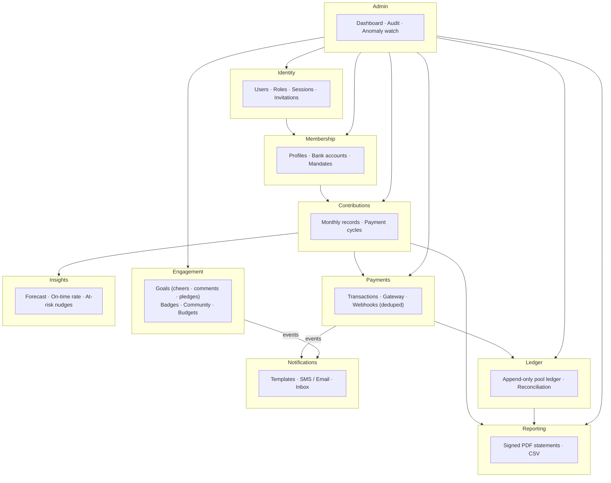
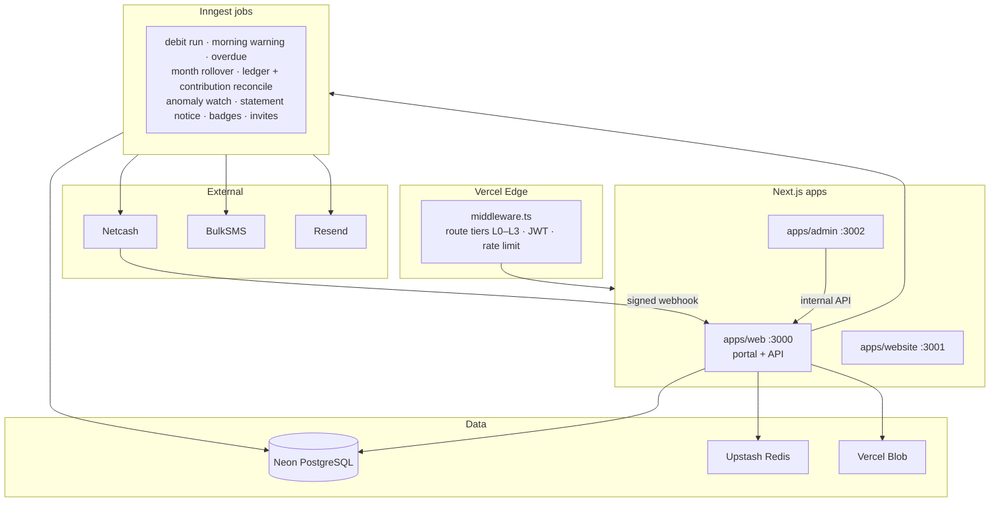
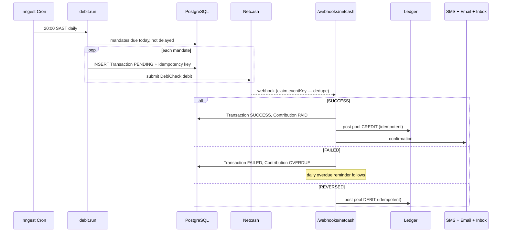
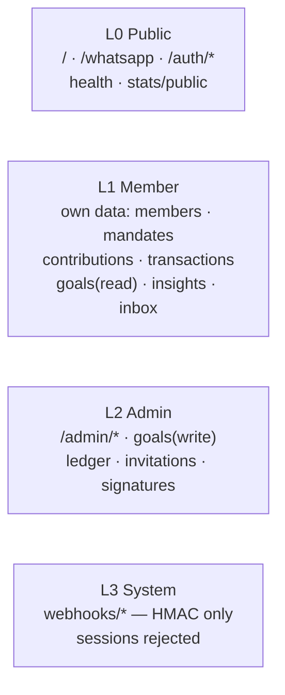

# System Overview

> *"It is more blessed to give than to receive."* — Acts 20:35

The whole system on one page. Deeper detail lives in [requirements](./requirements.md) · [architecture/](./architecture/) · [flows/](./flows/) · [database/01-erd.md](./database/01-erd.md) · [security/01-security-architecture.md](./security/01-security-architecture.md).

---

## What it is

| | |
|---|---|
| **System** | Xkimm Xa Mali Foundation (XXM) — family savings group |
| **Does** | Contribution tracking, automated DebiCheck debits, append-only financial ledger |
| **Users** | Admin (founder, dual-role) · Members |
| **Scale** | 4–50 members, <1,000 req/day (v1) |
| **Sensitivity** | Financial + PII — highest tier (POPIA) |
| **Platform** | Web, PWA-capable, mobile-first |

### Stack at a glance

| Layer | Tech | Why |
|---|---|---|
| Framework | Next.js 15 App Router | UI + API + jobs in one deployment |
| Database | PostgreSQL / Neon · Prisma 6 | ACID — non-negotiable for money |
| Auth | NextAuth v5 · JWT cookies | No `localStorage` token exposure |
| Payments | Netcash DebiCheck/NAEDO | SA-native recurring debit |
| Jobs | Inngest | Durable + retryable ([ADR-002](./adr/002-inngest-job-engine.md)) |
| Cache / limits | Upstash Redis | Serverless sliding windows |
| SMS · Email · Files | BulkSMS · Resend · Vercel Blob | |
| Monitoring | Sentry + Better Stack | Errors + uptime |

---

## Bounded contexts

No context reads another context's tables directly — all cross-context data flows through service interfaces.

### Data classification

| Entity | Class | Protection |
|---|---|---|
| Email, phone | PII | Indexed, not encrypted |
| SA ID number, bank account number | Sensitive / Financial PII | AES-256-GCM at rest |
| Transaction amounts, ledger | Financial | Access-controlled, `Decimal(10,2)` |
| Passwords | Credentials | bcrypt cost 12 |
| Reset / verify / invite tokens | Credentials | SHA-256 hash only |
| Session | Credentials | HTTP-only + Secure cookie, SameSite=Lax |

Data model: **34 models, 17 enums** — full ERD in [database/01-erd.md](./database/01-erd.md).

---

## Runtime architecture

### Monthly debit run + ledger

**Integration surface:** Netcash (debit submit + webhook), BulkSMS (SMS + receipts), Resend (email), Inngest (jobs), Vercel Blob (PDFs), WhatsApp (deep link only).

---

## API & route tiers

Base path `/api/v1/`. Full spec: [api-contract.yaml](./api-contract.yaml).

**Response envelope:** success `{ data, meta: { traceId, pagination? } }` · error `{ error: { code, message, traceId } }`.

---

## Security model

| Tier | Who | Scope |
|---|---|---|
| L0 | Public | Homepage, auth, health, public stats |
| L1 | Member | Own data only |
| L2 | Admin | All member data, financials, ledger, audit |
| L3 | System | Webhooks — HMAC only, no session |

**L4 hard blocks** (service-layer, can't be bypassed by middleware misconfig): members can't read another member's bank/ID number; members can't write `Transaction`/`Contribution`/`LedgerEntry` directly; admins can't delete transactions — only post a `REVERSED` (which writes a ledger DEBIT); webhook endpoints reject any request carrying a session cookie. Full model: [security/01-security-architecture.md](./security/01-security-architecture.md).

---

## Integrity & operations

**Key constraints:** `UNIQUE(userId, periodMonth, periodYear)` on Contribution (no double-billing) · `UNIQUE(idempotencyKey)` on Transaction (no double-charge) · `UNIQUE(refType, refId, direction)` on LedgerEntry (idempotent posting) · `UNIQUE(source, eventKey)` on ProcessedWebhookEvent (dedupe) · `Decimal(10,2)` on all money.

**Environments:** Local (Neon dev branch, no Docker) → Preview (Neon PR branch, auto per PR) → Production (Neon pooled). **Monitoring:** Sentry (errors), Better Stack (uptime on `/health`), Vercel Analytics (Web Vitals), Inngest dashboard (jobs).

**Build status:** all 13 modules (M01–M12 + M11a) and Phase-2 hardening complete; Phase-3 backend (ledger, webhook dedupe, anomaly watch, insights, resilience) shipped. See [build-order.md](./build-order.md). Go-live steps: [../DEPLOYMENT.md](../DEPLOYMENT.md).
